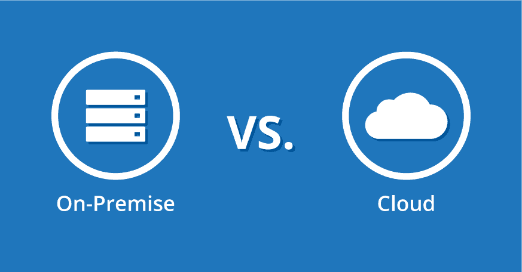

# Cloud vs On-Premise

Que choisir entre le Cloud et l'On-Premise ? Quels sont les avantages et les inconvénients de chacun ? Quels sont les critères à prendre en compte pour choisir entre le Cloud et l'On-Premise ?

## C'est quoi ?

### Cloud

Le cloud a vu le jour en 2002 quand Amazon a décidé de louer ses infrastructures/ressources à d'autres entreprises. Depuis, le cloud a évolué et est devenu un outil incontournable pour les entreprises.

Une solution dîte "cloud" est une solution qui est hébergée sur des serveurs distants, et donc accessible via Internet. Les serveurs sont gérés par un fournisseur externe, qui s'occupe de la maintenance, de la mise à jour, de la sécurité, etc...

### On-Premise

Contrairement à une solution cloud, une solution on-premise est hébergée sur une infrastructure locale et installée sur les postes de travail de l'entreprise.

## Avantages et inconvénients

| Avantages              | Cloud | On-Premise |
| ---------------------- | ----- | ---------- |
| Coût initial           | **X** | **-**      |
| Coût sur le long terme | **-** | **X**      |
| Scalabilité            | **X** | **-**      |
| Performance prévisible | **-** | **X**      |
| Flexibilité            | **X** | **-**      |
| Accessibilité          | **X** | **-**      |
| Sécurité               | **-** | **X**      |
| Maintenance            | **X** | **-**      |
| Choix des technos      | **-** | **X**      |

-   Les coûts initial et de maintenance sont plus élevés pour une solution on-premise. C'est un coût qu'une petite boîte ne peut pas forcément se permettre. Cependant, un service cloud s'utilise généralement sous forme d'abonnement, ce qui peut revenir plus cher sur le long terme.
-   Il y a ce souci de scalabilité, qui est plus facile à gérer dans le cloud. Le scaling pour une solution on-premise demande une bonne prédicition des besoins futurs, et peut être coûteux si mal estimé.
-   La performance est plus prévisible en on-premise, car l'entreprise a un contrôle direct sur le hardware et les réglages réseau.
-   Le cloud est plus flexible, car il est possible de changer rapidement les ressources pour s'adapter à la demande.
-   Le cloud est plus accessible car les services cloud sont accessibles de partout avec une connexion internet.
-   Les données sont plus sécurisées en on-premise, car elles sont sous le contrôle direct de l'entreprise. Stocker ses données sur le cloud revient à placer sa confiance dans le fournisseur de cloud.
-   La maintenance est plus compliquée en on-premise, car il faut constamment gérer et maintenir le matériel en bon état, mettre à jour le logiciel, ajouter des correctifs de sécurité, et résoudre les problèmes. Cela nécessite du personnel IT qualifié, ce qui peut augmenter les coûts et l'utilisation des ressources. En cloud, c'est le fournisseur qui s'occupe de tout ça.
-   Pour un service cloud, les technologies utilisées sont restreintes par le fournisseur. Vous ne pouvez pas utiliser un langage que le fournisseur ne supporte pas.
