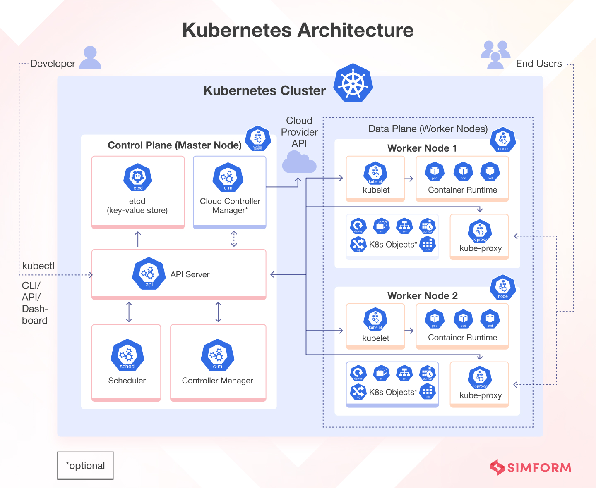

# Implication d'une Infrastructure AKS dans l'Architecture d'un Logiciel

## Introduction à AKS
AKS (Azure Kubernetes Service) est une solution de gestion de conteneurs proposée par Microsoft Azure. Il simplifie le déploiement et la gestion de clusters Kubernetes, permettant de gérer des applications conteneurisées de manière scalable et résiliente.

---

## Implications d'AKS dans l'Architecture Logicielle

### 1. **Couches Logiques et AKS**
- **Infrastructure as Code (IaC)** : AKS favorise l'automatisation et la reproductibilité des déploiements.
- **Container-Based Architecture** : AKS centralise la gestion des conteneurs (Docker, etc.) pour les microservices.

### 2. **Modèle C4 et AKS**
Lors de la schématisation via le modèle C4, AKS influence les vues suivantes :

#### **Diagramme de Contexte**
- **Positionnement** : AKS apparaît comme une plateforme gérant l'ensemble des conteneurs. Elle connecte l'application au cloud Azure et à ses services.
- **Exemple** :
    - Le système d'AKS peut être représenté comme un nœud central assurant l'exécution des microservices.
    - Les utilisateurs accèdent à l'application via des composants externes tels que des API Gateway.

#### **Diagramme Conteneur**
- **Organisation des Conteneurs** :
    - Les microservices (conteneurs Docker) sont schématisés comme des entités s'exécutant au sein du cluster AKS.
    - AKS est un "node pool" qui orchestre l'allocation de ressources.
- **Communication** :
    - Les services communiquent via des ingress controllers ou des services internes (ClusterIP, LoadBalancer).

#### **Diagramme Composant**
- **Déploiement de Composants** :
    - Chaque composant du logiciel peut correspondre à un pod déployé dans AKS.
    - Les interconnexions entre composants sont gérées par le réseau interne Kubernetes (CNI).

#### **Diagramme Code**
- **Abstraction via Helm Charts ou Manifestes YAML** :
    - Les détails du code source pour le déploiement sont définis via des fichiers de configuration spécifiques.
    - Ces fichiers détaillent l'allocation des ressources, les secrets et les règles de mise à l'échelle.

### 3. **Avantages dans une Architecture AKS**
- **Scalabilité** : Les microservices peuvent être mis à l'échelle dynamiquement.
- **Résilience** : Redondance et tolérance aux pannes offertes par Kubernetes.
- **Séparation des préoccupations** : Simplifie le déploiement grâce à la gestion isolée des microservices.

---

## Points à Considérer pour la Schématisation
- Inclure les éléments suivants :
    - **Ingress/Load Balancer** : Point d'entrée pour les utilisateurs externes.
    - **Node Pools** : Division des nœuds en groupes homogènes (CPU/GPU).
    - **Pods** : Représentation des instances de chaque composant.
    - **Volumes Persistants** : Stockage pour les données critiques.
- Montrer les liens avec les services Azure externes (Azure SQL, Storage, etc.).

---
# Conclusion
L'utilisation d'AKS impacte fortement l'architecture, en particulier dans les systèmes complexes adoptant des microservices. Une modélisation efficace avec le modèle C4 permet de mieux comprendre les interactions entre les couches logiques et de garantir une architecture robuste et évolutive.