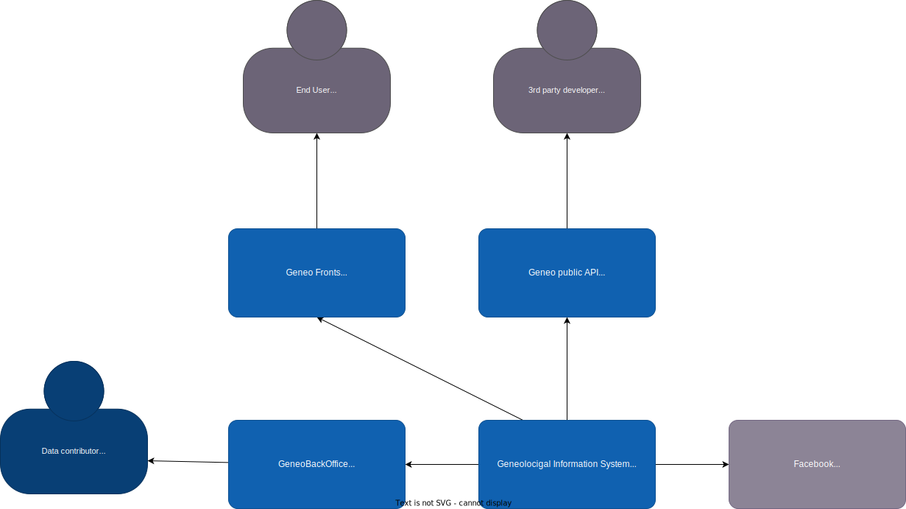
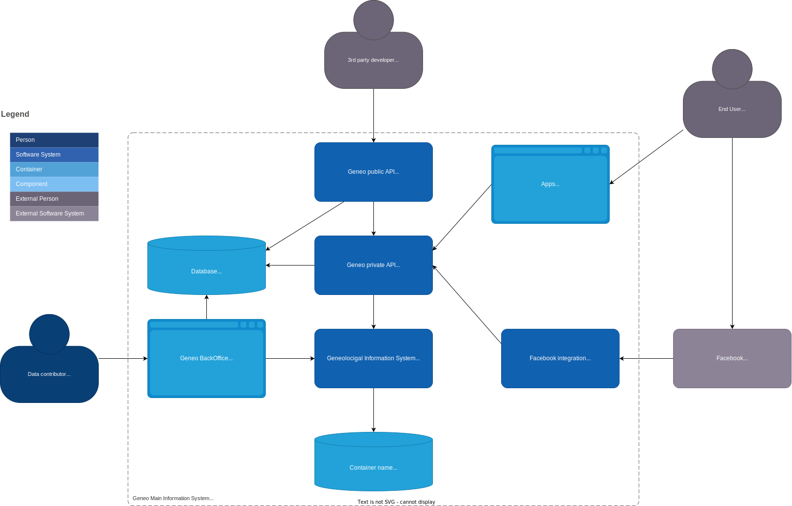
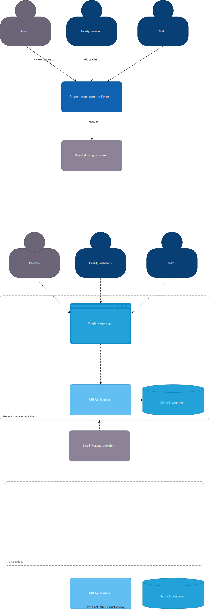

# Exemples de katas d'architecture logicielle

### Who's Your Daddy?

[Description](https://www.architecturalkatas.com/kata.html?kata=WhosYourDaddy.json)

> Organization wants to build the world's largest genealogical graph in history

> Requirements: data is graph-like, open-ended, and must be viewable and searchable over a variety of technology platforms (web, mobile, etc); API allowing third-party access to all of the data; Facebook integration; historical records (census, marriage, death, parish records, etc) are being added by teams of people in the field--each record must be viewed/transcribed and scanned twice and verified

> Users: millions of users, hundreds/thousands of third-party applications

<figure markdown="span">
  
  <figcaption>Geneo4all Level 1 - System context</figcaption>
</figure>

<figure markdown="span">
  
  <figcaption>Geneo4all Level 2 - Container diagram</figcaption>
</figure>

## TalesOfAFourthGrade

[TalesOfAFourthGrade proposé par architecturalkatas.com](https://www.architecturalkatas.com/kata.html?kata=TalesOfAFourthGrade.json)

> An elementary school system comprehensive student management system

> Requirements: track absences, tardies and excuses (entered by parents, faculty or staff); generate reports on student activities; be accessible from the playground; track student grades and assignments (completed and due); parent-teacher forums; run as an SaaS system from a hosting center

> Users: faculty, staff and student parents

??? Ouvrir pour voir le diagramme C4

    

## I'll Have the BLT

[Proposé par architecturalkatas.com](https://www.architecturalkatas.com/kata.html?kata=BLT.json)

> A national sandwich shop wants to enable "fax in your order" but over the Internet instead (in addition to their current fax-in service)

> Users: millions+

> Requirements: users will place their order, then be given a time to pick up their sandwich and directions to the shop (which must integrate with Google Maps); if the shop offers a delivery service, dispatch the driver with the sandwich to the user; mobile-device accessibility; offer national daily promotionals/specials; offer local daily promotionals/specials; accept payment online or in person/on delivery

| **Fonctionnalité**               | **Description**                                                                                                | **Mise en place** |
| -------------------------------- | -------------------------------------------------------------------------------------------------------------- | ----------------- |
| Commande de sandwich             | Estimation du temps de préparation + facturation                                                               |                   |
| PWA responsive                   | Commande + code de récupération + heure de récupération + itinéraire + livraison si disponible                 |                   |
| Calcul de l'itinéraire           | Intégration avec Google maps                                                                                   |                   |
| Paiement                         | Sur place ou en ligne                                                                                          |                   |
| Livraison                        | Envoi de notification au livreur (qui est un un interne)                                                       |                   |
| Promotions                       | Informations renseignées par l'équipe marketing ou les managers et peuvent choisir au niveau local ou national |                   |
| +1 millions d'utilisateurs       | Système réactif et qui se met à l'échelle                                                                      |                   |
| Synchro commandes internet / fax | S'assure que le SI gère bien les deux types de commandes                                                       |                   |
