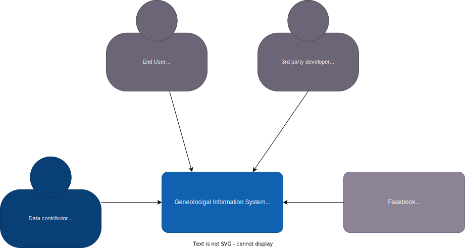

# Exemples de katas d'architecture logicielle

### Who's Your Daddy?

[Description](https://www.architecturalkatas.com/kata.html?kata=WhosYourDaddy.json)

> Organization wants to build the world's largest genealogical graph in history

> Requirements: data is graph-like, open-ended, and must be viewable and searchable over a variety of technology platforms (web, mobile, etc); API allowing third-party access to all of the data; Facebook integration; historical records (census, marriage, death, parish records, etc) are being added by teams of people in the field--each record must be viewed/transcribed and scanned twice and verified

> Users: millions of users, hundreds/thousands of third-party applications

<figure markdown="span">
  
  <figcaption>Geneo4all Level 1 - System context</figcaption>
</figure>

<figure markdown="span">
  
  <figcaption>Geneo4all Level 2 - Container diagram</figcaption>
</figure>

## TalesOfAFourthGrade

[TalesOfAFourthGrade proposé par architecturalkatas.com](https://www.architecturalkatas.com/kata.html?kata=TalesOfAFourthGrade.json)

> An elementary school system comprehensive student management system

> Requirements: track absences, tardies and excuses (entered by parents, faculty or staff); generate reports on student activities; be accessible from the playground; track student grades and assignments (completed and due); parent-teacher forums; run as an SaaS system from a hosting center

> Users: faculty, staff and student parents

