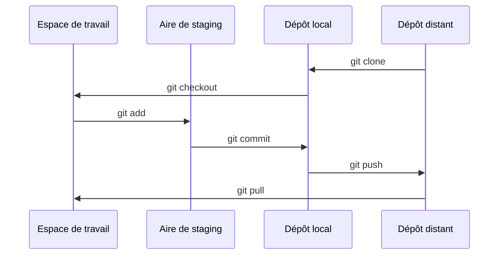
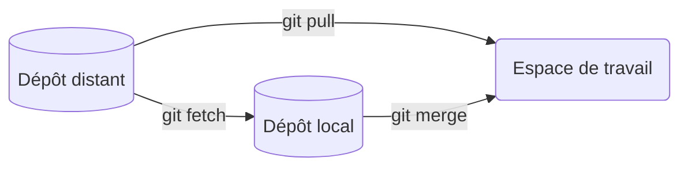
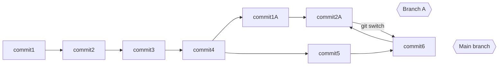
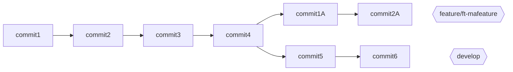
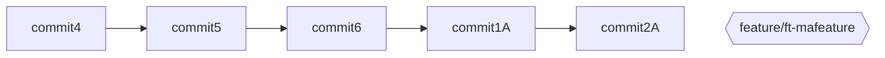
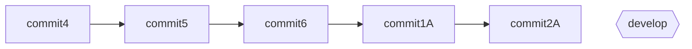

# Exposés 23 24

## GraphQL (par Tom)

Alternative au APIs REST et approche moderne de déliverance des données.

### Kesako ?

GraphQL est un langage de requête pour votre API et un environnement d'exécution de requêtes côté serveur pour exécuter ces requêtes en utilisant les données existantes. GraphQL décrit les données de l'API et fourni un moyen d'accès à ces données. Il suffit de piocher ce dont vous avez besoin.

### Pourquoi GraphQL ?

- **Demander ce dont vous avez besoin** : GraphQL permet aux clients de demander des données exactement comme ils en ont besoin. GraphQL est une alternative aux API REST.

- **Un seul point d'entrée** : GraphQL fournit un seul point d'entrée pour exécuter des requêtes. Cela signifie que vous n'avez pas besoin de gérer plusieurs points d'entrée pour différentes versions de votre API.

- **Documentation automatique** : GraphQL fournit une documentation automatique pour votre API. Cela signifie que vous n'avez pas besoin de maintenir une documentation séparée pour votre API.

- **Évolution de l'API** : GraphQL permet d'évoluer l'API sans casser les clients existants. Cela signifie que vous pouvez ajouter de nouveaux champs à votre API sans casser les clients existants.

- **Outils de développement** : GraphQL fournit des outils de développement puissants pour les développeurs. Cela signifie que vous pouvez, par exemple, utiliser des outils tels que GraphiQL pour tester vos requêtes GraphQL.

## Pourquoi ne pas l'utiliser ?

- **Cache** : GraphQL a du mal à cacher ses données car contrairement aux API REST, les méthodes de caching ne sont pas définis par les CDNs, Proxies, Serveurs Web, et navigateurs.
- **Coût de l'infrastructure** : GraphQL nécessite plus de ressources pour exécuter des requêtes que les API REST.
- **Client Integration** Contrairement aux API REST, GraphQL nécessite un client spécialisé pour exécuter des requêtes. Cela signifie que vous devez utiliser un client GraphQL pour exécuter des requêtes GraphQL là où en REST, on utilise des outils simples comme cURL, intégrés dans la plupart des cas par défaut.

### Comment ça marche ?

GraphQL est composé de 5 parties principales :

1. Queries (requêtes) : Les requêtes GraphQL sont utilisées pour demander des données spécifiques au serveur. Elles permettent aux clients de spécifier exactement quelles données ils ont besoin, et le serveur renvoie uniquement ces données.

2. Mutations (mutations) : Les mutations sont utilisées pour modifier les données du serveur. Contrairement aux requêtes, qui sont utilisées pour la lecture de données, les mutations permettent d'effectuer des opérations telles que la création, la mise à jour ou la suppression de données.

3. Types (types) : GraphQL définit un système de types pour décrire la structure des données disponibles. Les types sont utilisés pour spécifier quels champs peuvent être demandés sur un objet et quels types de données ils contiennent.

4. Schemas (schémas) : Un schéma GraphQL est une description de tous les types de données disponibles dans l'API, ainsi que des relations entre ces types. Il définit quels types de requêtes et de mutations peuvent être exécutés.

5. Resolvers (résolveurs) : Les résolveurs sont des fonctions qui définissent comment les données doivent être récupérées ou modifiées pour chaque champ d'un type dans le schéma. Chaque champ d'un type peut avoir son propre résolveur, ce qui permet une grande flexibilité dans la façon dont les données sont obtenues ou manipulées.


### Exemple

Voici un exemple de requête GraphQL :

```graphql
query {
  user(id: 1) {
    id
    name
    email
  }
}
```

### Experimenter

Dirigez-vous vers l'[API GraphQL d'Atlassian](https://hello.atlassian.net/gateway/api/graphql)

## How Google/Apple Pay work (Julian)

### Fonctionnement de l'Apple Pay

Apple Pay est système existant depuis 2013, permettant de pouvoir utiliser des cartes à l'aide de son téléphone, notamment des cartes bancaires. Cela fonctionne en utilisant le concept de tokenization.
Dans un premier temps, lorsque vous allez rentrer vos informations bancaire dans votre device Apple, dans ces informations ce qui va nous intéresser c'est le PAN (numéro à 16 chiffres ou 19 suivant la carte, qui est au recto de votre carte bancaire).
Après avoir saisi ces informations, le PAN va être enregistré sur un serveur sécurisé de Apple. Ensuite ce PAN va être vérifier par la banque puis à l'aide du TSP, un token va être ressorti.
Ce token va être renvoyer au device Apple et va être stocké dans un élément sécurisé du device. Cet ensemble (élément sécurisé + token) s'appelle DAN.

Après avoir enregistrer votre carte, le paiement fonctionne à l'aide du système NFC du device.
Lorsque vous approcher votre téléphone du TPE, à l'aide du NFC, le DAN va être envoyé au TPE, puis le TPE va communiquer avec la banque pour communiquer le DAN. Après vérification du token par la banque et par le moyen de paiement (visa, mastercard...), il va y avoir détokenisation à l'aide de TSP, puis le paiement s'effectuera avec les infos détokenisées.

### Fonctionnement Google Pay

 Google Pay, ou plutôt google wallet, existe depuis 2014. Anciennement android Pay, le fonctionnement de Google Pay est pratiquement le même que celui d'Apple Pay. Il y a quelques différences entre les 2 systèmes.
Premièrement, le token généré à partir des informations bancaires, sur android, n'est pas stocké dans un élément sécurisé comme pour un device Apple. Le token va être stocké directement dans l'application Google Wallet.
Deuxièmement, ce même token va être stocké sur un serveur de Google à la différence de Apple qui eux ne stockent pas cette information sur leur serveur.

Pour le paiement, le fonctionnement est similaire à celui d'Apple, à la différence qu'ils utilisent un système de HCE, (Host Card Emulation) avec le token récupérer du serveur ou de l'app.

## Comment fonctionne Git ? (Hugo)

Tout d'abord, notre code réside non pas dans 2, mais 4 endroits différents :

| Endroit | Description |
| -- | -- |
| Espace de travail | Dossier courant de notre projet |
| Aire de Staging | Endroit temporaire où les changements de nos fichiers sont enregistrés |
| Dépôt local | Dépôt de nos changements validés uniquement présent sur notre ordinateur |
| Dépôt distant | Serveur (comme GitHub) pour partager et sauvegarder notre code |

### Déroulé

La plupart des commandes git déplacent notre code entre ces 4 endroits:



- [**git clone**](https://git-scm.com/docs/git-clone/fr) clone un répertoire distant en local, nous permettant de modifier ses fichiers dans notre espace de travail

- [**git checkout**](https://git-scm.com/docs/git-checkout/fr) bascule sur une autre branche ou restaure un espace de travail

- [**git add**](https://git-scm.com/docs/git-add/fr) ajoute le contenu des fichiers modifiés dans l'aire de staging en attendant leur validation

- [**git commit**](https://git-scm.com/docs/git-commit/fr) enregistre les changements de l'aire de staging dans le dépôt local

- [**git push**](https://git-scm.com/docs/git-push/fr) envoie les changements locaux sur le dépôt distant

- [**git pull**](https://git-scm.com/docs/git-pull/fr) récupère les changements du dépôt distant

---

>La commande **git pull** est en réalité l'association de deux commandes : **git fetch** et **git merge**



- [**git fetch**](https://git-scm.com/docs/git-fetch/fr) récupère les dernières mises à jour depuis le dépôt distant

- [**git merge**](https://git-scm.com/docs/git-merge/fr) applique ces mises à jour au dépôt local

### Git branching

L'intérêt de git réside dans son système de branche : un même dépôt peut contenir plusieurs versions d'un même code, cahcune résidant dans sa propre branche.

Les commandes **git checkout** (voir ci-dessus) et [**git switch**](https://git-scm.com/docs/git-switch) permettent de naviguer entre ces branches.



#### Pratiques

On rencontre courramment différents noms de branches, chacun correspondant à un environnement précis :

- **main ou master** : production
- **develop** : développement
- **feature** : fonctionnalité qui sera fusionnée sur develop, puis sur main/master
- **hotfix** : qui vise à corriger un souci sur la main/master
- etc...

### Conflits

Imaginons un cas dans lequel j'ai créé une branche depuis la develop, mais que celle-ci a évolué entretemps :



Pour fusionner ma branche et la redescendre dans develop, je vais devoir intégrer son historique dans ma branche avec un **rebase** ou un merge de **develop** dans ma branche, ce qui me donnera l'historique local suivant au niveau de ma feature :



Je peux ensuite la fusionner dans develop, ce qui à terme donnera


