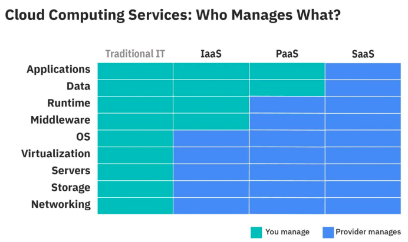

# Technologies en vrac

Afin de proposer une bonne architecture, il est utile d'avoir un bon état de l'art.
Une ressource qui nous aide à cela est le site [bytebytego.com](https://bytebytego.com/) et plus particulièrement leur chaîne [YouTube](https://www.youtube.com/@ByteByteGo)

## Quelques technologies

|   Technology |   Description | Cas d'usage | Alternatives  |  Liens  |
|---           |---            |---             |---      |---      |
|   [Kafka](https://kafka.apache.org/) |  Plateforme distribuée de gestion de flux d'évènement  |  Communication temps réel, Collecte de logs  |  Technologies de type message queue (Rabbit MQ, Confluent)  | [System Design: Why is Kafka so Popular?](https://www.youtube.com/watch?v=yIAcHMJzqJc) |
|   [Elastic](https://www.elastic.co/) |  Suite d'outils elastic search pour faire de la recherche sur des données  |  Recherche dans les logs, recherche temps réel  |  Datadogs, etc.  |  |
|  [Kibana](https://www.elastic.co/fr/kibana)  |  Outils de visualisatiob de données (dashboard)  |  Analyse de données temps réel, surveillance de logs  |  Prometheus, etc.  | |
|  [Flink](https://flink.apache.org/)  |  Moteur de traitement flux à haut débit et faible latence  |  Traitement temps réel sur de gros volumes de données (optimisation des résultats de recherche en temps réel)  ([exemples](https://flink.apache.org/what-is-flink/powered-by/)) |    | |

## Fonctionnement de quelques systèmes

- [Live streaming](https://www.youtube.com/watch?v=7AMRfNKwuYo)

## Quelques concepts

- [IaaS/PaaS/SaaS](https://www.ibm.com/topics/iaas-paas-saas)
  

## Ressources

- [System Design PDFs](https://blog.bytebytego.com/p/free-system-design-pdf-158-pages)
  - [Le pdf en question](https://blog.bytebytego.com/api/v1/file/d60fa09a-c4b5-4e31-9dbd-5d049c6c8f49.pdf) (Si le lien ne march pas, essayer depuis le lien di-dessus)
